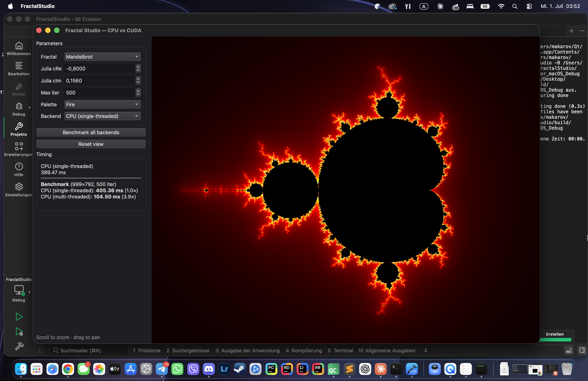

# Fractal Studio — CPU vs CUDA

An interactive escape-time fractal explorer built with **Qt 6 (C++17)** that
runs the *same* computation on three different back-ends and compares their
performance live in the UI:

- **CPU (single-threaded)** — a straightforward baseline
- **CPU (multi-threaded)** — the same math parallelized across rows with `std::thread`
- **CUDA (GPU)** — one thread per pixel, computed, colored and down-sampled on the GPU

All back-ends share the same iteration code (`FractalMath.h`) and the same
coloring pipeline (`ColorMap.h`), so their output is **pixel-for-pixel
identical** — what you compare is speed, not results.



## Features

- **Five fractals**: Mandelbrot, Julia (adjustable constant `c`),
  Burning Ship, Tricorn, and Multibrot `z^n + c` with adjustable exponent
- **Right-click on the Mandelbrot set to pick a Julia constant** — the app
  switches to the Julia set seeded at the point under the cursor
- **Asynchronous rendering** on a worker thread: the UI never blocks, even on
  multi-second CPU renders. During zoom/pan a quick half-resolution preview is
  shown, then the view automatically settles to a sharp full-resolution frame
  (latest-wins request coalescing — stale frames are never rendered)
- **float / double precision toggle** for every back-end. `float` is fast but
  bottoms out around span 1e-5; `double` reaches ~1e-13 — and on a consumer
  GPU the benchmark makes the FP64 throttling (~1:64) plainly visible
- **2×2 supersampling** — on the GPU both the render and the box-filter
  down-sample run on the device, so the PCIe transfer stays at 1× regardless
- Six palettes (Electric / Fire / Ocean / Twilight / Neon / Grayscale) with
  **density** and **offset** sliders for live palette tuning
- **PNG export** at 1× / 2× / 4× of the view size, always antialiased,
  rendered off the GUI thread
- **Benchmark all back-ends**: 3 runs each, best time and speedup vs the
  single-threaded CPU baseline, streamed to the UI progressively
- Live status bar: complex coordinate under the cursor and zoom magnification
- Mouse-wheel zoom (toward the cursor), drag-to-pan, keyboard shortcuts
  (Ctrl+B benchmark, Ctrl+R reset view, Ctrl+E export)
- Dark Fusion theme for clean screenshots

## Requirements

- **Qt 6** (Widgets module)
- **CMake 3.20+**
- A C++17 compiler (MSVC 2022 / GCC / Clang)
- For the GPU back-end: **NVIDIA CUDA Toolkit** and an NVIDIA GPU
  (without them the project builds in CPU-only mode — see below)

## Building a Visual Studio solution (Windows, with CUDA)

The easiest path — no hand-written project files, CMake configures Qt's MOC step,
the CUDA build and all include/lib paths for you:

1. Open `generate_vs_solution.bat`, set `QT_DIR` to your Qt installation
   (e.g. `C:\Qt\6.7.2\msvc2022_64`), and save.
2. Double-click `generate_vs_solution.bat`. It produces `build\FractalStudio.sln`.
   (CMake auto-detects your installed Visual Studio, so this works with both
   VS 2022 and VS 2026.)
3. Open `build\FractalStudio.sln`, set **FractalStudio** as the startup project,
   choose **Release | x64**, and build.

The project targets architecture `sm_89` (RTX 40xx / Ada) by default. Change it
by editing `CUDA_ARCH` in the `.bat` (e.g. `86` for Ampere, `75` for Turing).

### Alternative: open the folder directly

Modern Visual Studio can open the project as a CMake folder:
**File → Open → Folder…** and pick the project root. `CMakePresets.json`
provides ready-made *vs2022-cuda* and *vs2022-cpu* configurations (adjust the
Qt path inside the preset first).

### Alternative: command line

```powershell
cmake -B build -S . -A x64 -DCMAKE_PREFIX_PATH="C:/Qt/6.x.x/msvc2022_64" -DCUDA_ARCH=89
cmake --build build --config Release
```

## Building without CUDA (CPU only)

If the CUDA Toolkit is not installed, or you want a pure CPU build
(this is also how the project builds on macOS and Linux):

```powershell
cmake -B build -S . -DUSE_CUDA=OFF -DCMAKE_PREFIX_PATH="C:/Qt/6.x.x/msvc2022_64"
cmake --build build --config Release
```

The CUDA back-end simply disappears from the UI; the two CPU back-ends remain.

## Usage

1. Pick a fractal and a palette; tune the palette with the density/offset sliders.
2. Scroll to zoom in/out; drag to pan. A fast preview keeps interaction fluid,
   then the image sharpens automatically.
3. Right-click anywhere on the Mandelbrot set to explore the Julia set of that point.
4. Switch **Backend** and **Precision** to see each configuration's render time.
5. Click **Benchmark all backends** (Ctrl+B) for a best-of-3 summary with speedups.
6. **Export PNG…** (Ctrl+E) saves an antialiased image at up to 4× the view size.

## Architecture

```
GUI thread                          worker thread (QThread)
──────────                          ───────────────────────
MainWindow ── renderJob ──────────▶ RenderWorker
    ▲          benchmarkJob             │ owns FractalRenderer
    │          exportJob                │
    └── renderDone / benchLine ◀────────┘
        (queued signals)                 ├─ CPU: computeRows<T>() over std::thread pool
                                         └─ CUDA: fractalKernel<T><<<...>>>
                                                  + downsampleKernel on device
```

- **At most one job is in flight**; while it runs, the newest request replaces
  the pending one (latest-wins). A preview frame that settles with nothing
  queued automatically triggers the full-quality frame.
- `Types.h`, `FractalMath.h` and `ColorMap.h` are Qt-free and compile under
  both a normal C++ compiler and nvcc. The `FR_HD` macro expands to
  `__host__ __device__` under nvcc and to nothing otherwise, so a single
  `fr_iterate<T>()` / `fr_shade()` implementation runs on both the CPU and the GPU.
- The iteration is templated on the floating-point type — `fr_iterate<float>`
  and `fr_iterate<double>` are instantiated on both back-ends, which is what
  makes the float-vs-double GPU comparison honest.
- Coloring and down-sampling happen on the device: the GPU returns a finished
  image, and the reported time includes the kernels **and** the device-to-host
  copy — an honest "time to get a displayable image".
- The CUDA and Qt layers are kept strictly separate (nvcc and Qt's MOC don't
  mix): the GPU code talks to the app through the Qt-free `CudaFractal.h`
  interface only.

## Possible improvements

- Perturbation theory + series approximation for arbitrarily deep zoom
- CUDA–OpenGL interop: render straight from GPU memory with no host copy
- Histogram-equalized coloring and palette import
- Zoom animation recording (frame sequence export)

## License

MIT — do whatever you like, no warranty.
